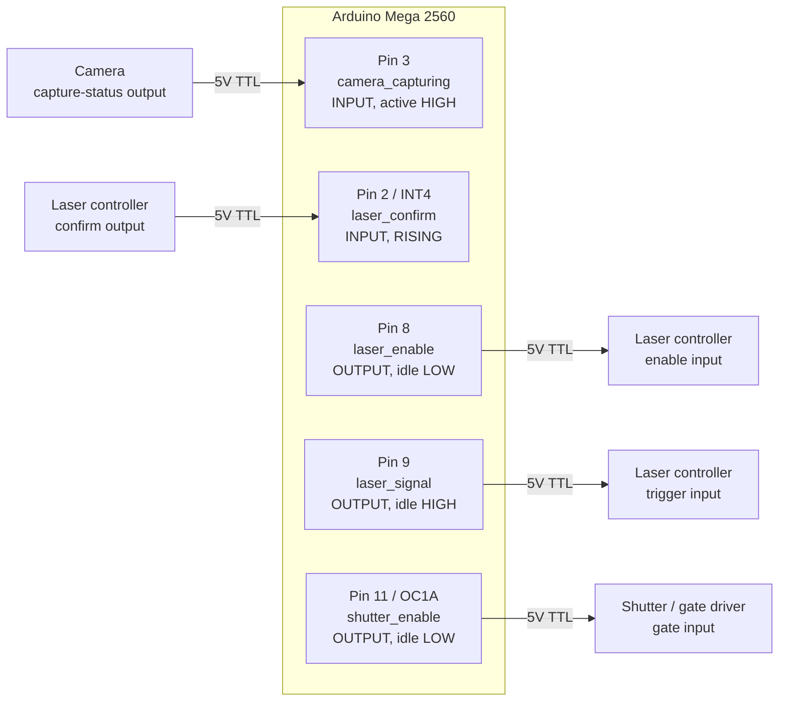
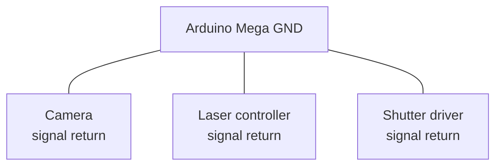
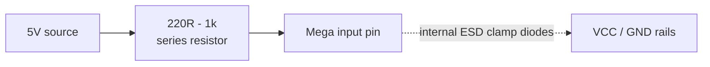
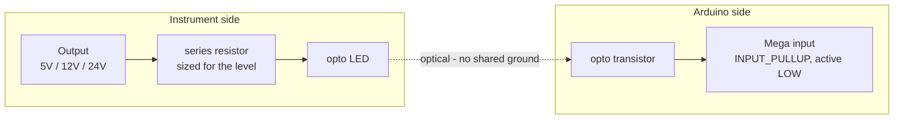
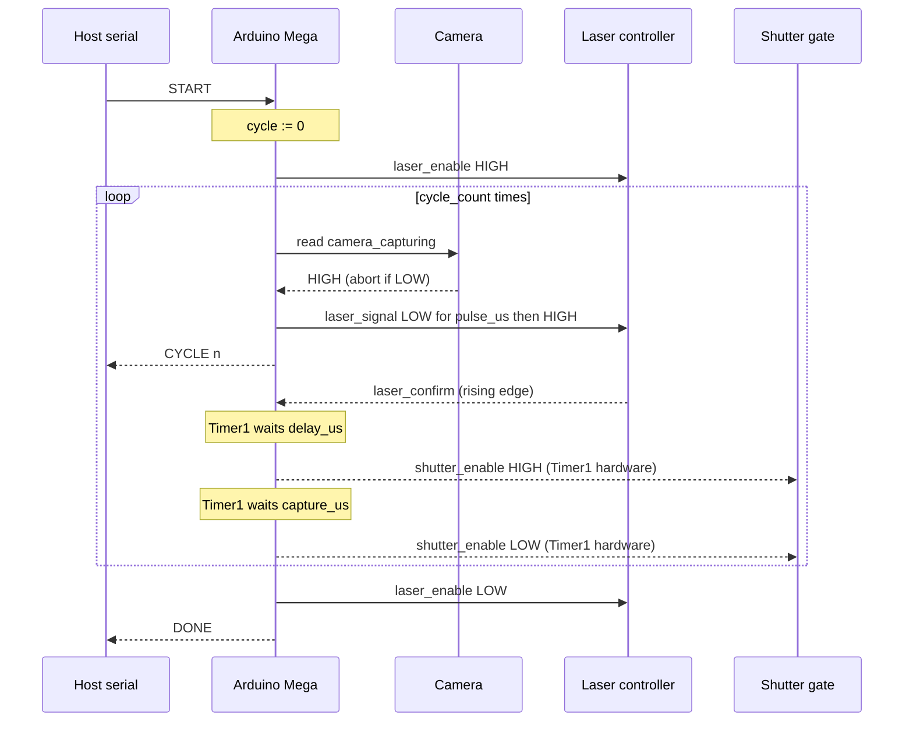
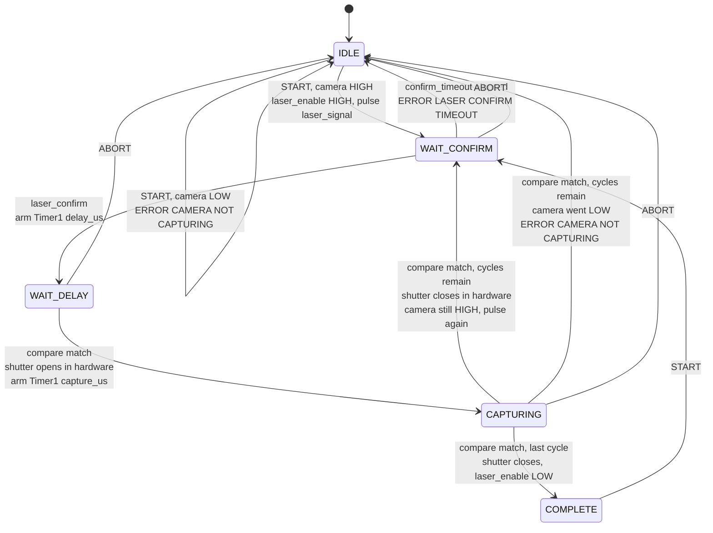

# 5 — Capture Sequence

The capture controller for the FRET rig. Arduino Mega 2560.

Runs `cycle_count` iterations of: verify the camera is rolling, hand off to the
laser, wait a configured delay, then open a capture gate for a configured
window. The delay and capture edges are produced by the Timer1 compare output
rather than by software, so interrupt latency stays out of the timing path.

Builds on [sketch 2](../2_pure_hardware_trigger) for the hardware-toggle
technique and [sketch 3](../3_serial_config) for the serial command interface.

> **Status:** compiles clean, **not yet hardware tested**. The `laser_signal`
> pulse width and the `laser_confirm` timeout were unspecified; both default to
> a guess (10 µs and 5000 ms) and are adjustable at runtime with `SET PULSE`
> and `SET CONFIRM_TIMEOUT`.

## Signals

| Signal | Pin | Direction | Idle |
|--------|-----|-----------|------|
| `laser_confirm` | 2 (INT4) | in | — |
| `camera_capturing` | 3 | in | — |
| `laser_enable` | 8 | out | LOW |
| `laser_signal` | 9 | out | HIGH |
| `shutter_enable` | 11 (OC1A) | out | LOW |

The [signal map](#signal-map) below shows how these five orchestrate a cycle.

`shutter_enable` must stay on pin 11 — it is the Timer1 Compare A output, and
that is what produces the gate edges in hardware.

`laser_confirm` must stay on an external interrupt pin. On the Mega 2560 those
are INT0=21, INT1=20, INT2=19, INT3=18, INT4=2, INT5=3.

Inputs are treated as **active-high and push-pull**. If a source is
open-collector, switch it to `INPUT_PULLUP`, flip `CAMERA_ACTIVE_LEVEL`, and
set `LASER_CONFIRM_EDGE` to `FALLING` — the latter two are in `Config.h`, the
`pinMode` call is in `setup()`.

## Wiring



## Grounding

Every signal above is referenced to the Arduino's ground. Without a shared
return the levels are meaningless and inputs can be damaged — this is the most
common way a working 5V signal kills a pin.



## Input protection

5V logic is what the Mega expects: V<sub>IH</sub> is 0.6 × VCC = 3.0 V, and the
absolute maximum on a pin is VCC + 0.5 V = 5.5 V. Direct connection is fine for
genuine 5V push-pull sources on short cables.

A series resistor costs nothing and limits current through the internal ESD
clamps if a line ever overshoots past 5.5 V:



For instruments on separate supplies, long cable runs, or any output above 5 V,
use an optocoupler instead. This also removes ground loops between instrument
chassis and protects the board when the instrument is powered but the Arduino
is not — an easy state to hit in a lab:



Note the optoisolated form inverts the signal and needs a pull-up, so it is the
`INPUT_PULLUP` / `FALLING` configuration described under Signals.

## Signal map

A cycle is a closed loop that leaves the board on `laser_signal`, comes back
on `laser_confirm`, and only then lets Timer1 place the shutter gate. The two
inputs play different roles: `laser_confirm` is an **edge** that advances the
sequence, `camera_capturing` is a **level** that gates it. Of the outputs,
`laser_enable` is held for the whole run, `laser_signal` is a short pulse per
cycle, and `shutter_enable` is the one deliverable the whole thing exists to
place.

Solid arrows are edges that drive the sequence forward; dotted arrows are
levels sampled and timeouts — conditions rather than events. The two
thick-bordered nodes are transitions the hardware produces with no software in
the path.


Reading the loop as responsibilities rather than as a path:

| Signal | Who drives the edge | What it costs the timing |
|--------|--------------------|--------------------------|
| `laser_enable` | `loop()`, once per run | nothing — outside the timed window |
| `camera_capturing` | the camera; sampled in `beginCycle()` | nothing — read before the pulse |
| `laser_signal` | `loop()`, blocking `delayMicroseconds()` | `pulse_us`, before the timed window opens |
| `laser_confirm` | the laser; latched by an external interrupt | one ISR entry, before `delay_us` starts counting |
| `shutter_enable` | Timer1/OC1A, in hardware | none — no software between the compare match and the pin |

That last row is the point of the design, but it is worth being precise about
what it does and does not buy. Each *edge* is placed by the compare match
itself, so nothing `loop()` happens to be busy with — a serial write, a
blocking `delayMicroseconds()` — can push it late. What software still sits in
is the *arming* of each interval: `delay_us` is armed by `laserConfirmISR()`
and `capture_us` is re-armed by the compare ISR, and both reset `TCNT1`. Each
interval therefore runs about one interrupt entry longer than its configured
value — a few microseconds at 16 MHz. Small and near-constant, but not zero;
if the gate width has to be exact, measure it and trim `CAPTURE` to suit.

### One cycle in time

Not to scale: `delay_us` and `capture_us` are configurable up to a second each,
while `pulse_us` defaults to 10 µs.

```
                        START       confirm             open                    close done
                        v           v                   v                       v     v
  camera_capturing  ‾‾‾‾‾‾‾‾‾‾‾‾‾‾‾‾‾‾‾‾‾‾‾‾‾‾‾‾‾‾‾‾‾‾‾‾‾‾‾‾‾‾‾‾‾‾‾‾‾‾‾‾‾‾‾‾‾‾‾‾‾‾‾‾‾‾‾‾‾‾‾‾
  laser_enable      ____/‾‾‾‾‾‾‾‾‾‾‾‾‾‾‾‾‾‾‾‾‾‾‾‾‾‾‾‾‾‾‾‾‾‾‾‾‾‾‾‾‾‾‾‾‾‾‾‾‾‾‾‾‾‾‾‾‾‾‾‾‾\_____
  laser_signal      ‾‾‾‾‾‾‾‾\__/‾‾‾‾‾‾‾‾‾‾‾‾‾‾‾‾‾‾‾‾‾‾‾‾‾‾‾‾‾‾‾‾‾‾‾‾‾‾‾‾‾‾‾‾‾‾‾‾‾‾‾‾‾‾‾‾‾‾‾‾
  laser_confirm     ________________/‾\_____________________________________________________
  shutter_enable    ____________________________________/‾‾‾‾‾‾‾‾‾‾‾‾‾‾‾‾‾‾‾‾‾‾‾\___________
                                    |<---- delay_us --->|<------ capture_us --->|
```

`camera_capturing` is drawn flat because a cycle cannot start without it, but
it is only *read* once per cycle, just before the `laser_signal` pulse — a
camera that drops out mid-gate is not noticed until the next cycle begins. Only the rising edge of
`laser_confirm` matters; how long the laser holds it is ignored. And the gap
between `laser_signal` rising and `laser_confirm` arriving belongs to the
laser controller, not to this sketch — it is unbounded except by
`confirm_timeout`.

For a second cycle, everything from the camera sample to the shutter close
repeats with `laser_enable` still high; it drops only after the final gate
closes.

## Sequence



## State machine



The shutter transitions are marked *in hardware* because Timer1 drives OC1A
directly — the ISR runs after the edge has already happened and only decides
what comes next.

Two implementation details the diagram smooths over. The camera re-check and
the next `laser_signal` pulse happen in `loop()`, not in the ISR — the ISR sets
a flag, so the state stays `CAPTURING` for the moment between the shutter
closing and the next cycle arming. And a `confirm_timeout` of `0` removes the
`WAIT_CONFIRM --> IDLE` timeout edge entirely.

## Commands

9600 baud, newline-terminated, case-insensitive. On boot the sketch prints the
banner described under [Boot banner](#boot-banner) and then `READY`. `READY` is
still the last line of boot output, so a host that waits for it needs no
changes.

Baud is `SERIAL_BAUD` in `Config.h` — raise it to 115200 if you intend to use
verbose logging.

| Command | Range | Default | Meaning |
|---------|-------|---------|---------|
| `SET DELAY <us>` / `GET DELAY` | 1–1000000 µs | 1 | laser_confirm to shutter open |
| `SET CAPTURE <us>` / `GET CAPTURE` | 1–1000000 µs | 50 | shutter gate width |
| `SET CYCLE_COUNT <n>` / `GET CYCLE_COUNT` | 1–65535 | 1 | iterations per `START` |
| `SET PULSE <us>` / `GET PULSE` | 1–16383 µs | 10 | laser_signal low-pulse width |
| `SET CONFIRM_TIMEOUT <ms>` / `GET CONFIRM_TIMEOUT` | 0–600000 ms | 5000 | **0 disables** |
| `SET VERBOSE <0\|1>` / `GET VERBOSE` | 0–1 | 0 | Event logging, see below |
| `START` | — | — | Runs the sequence |
| `ABORT` (or `STOP`) | — | — | Drops laser_enable, releases the shutter |
| `STATUS` | — | — | State, cycle progress, live camera level |
| `INFO` | — | — | Reprints the boot banner |
| `HELP` (or `?`) | — | — | Lists every command |

`SET PULSE` is the runtime control for `LaserSignalPulseUs`;
`SET CONFIRM_TIMEOUT` for `ConfirmTimeoutMs`.

### HELP

`HELP` (or `?`) prints the table above from the firmware itself, with the
limits built from the same constants the parser enforces, so it cannot drift
out of step with the build actually on the board:

```
> HELP
OK HELP
  START                     run CYCLE_COUNT cycles
  ABORT | STOP              stop, drop laser_enable, free shutter
  STATUS                    state, cycle progress, camera level
  INFO                      reprint the boot banner
  HELP | ?                  this list

  SET DELAY <us>            1-1000000us   laser_confirm to shutter open
  SET CAPTURE <us>          1-1000000us   shutter gate width
  SET CYCLE_COUNT <n>       1-65535       cycles per START
  SET PULSE <us>            1-16383us     laser_signal low-pulse width
  SET CONFIRM_TIMEOUT <ms>  0-600000ms    confirm wait, 0 disables
  SET VERBOSE <0|1>         0-1           measured event log

  GET reads back any of the six settings, e.g. GET DELAY.
  SET, HELP and INFO are rejected with ERROR BUSY while running.
OK HELP END
```

Every body line is indented by two spaces and the block is bracketed by
`OK HELP` and `OK HELP END`, so a host reading line by line can swallow
everything between the two markers without parsing the entries. The boot
banner below is the only other multi-line response and follows the same shape.

`HELP` is rejected with `ERROR BUSY` while a sequence is running, for a
different reason than `SET` is. The block is roughly 700 bytes — about 700 ms
at 9600 baud once the 64-byte transmit buffer backs up — and `loop()` is what
starts each next cycle, so printing it mid-run would stretch the gap between
cycles. The text is stored in flash with `F()`; in RAM it would cost a tenth of
the Mega's SRAM.

### Boot banner

`setup()` prints a banner before `READY`, and `INFO` reprints it on demand.
It answers the three questions asked at the start of every bring-up session:
what is running on this board, how is it wired, and what is it set to.

```
INFO
              ___
             |[_]|
             |   |
             | | |
            _|___|_
           |       |
            \_____/
             \___/
        _______________
       |  [=========]  |
       |_______________|
              | |
         _____|_|_____
        /             \
       /_______________\

  FRET Capture Sequence Controller
  version 1.0.0   built Sep 23 2026 18:42:11
  Arduino Mega 2560   serial 9600 8N1

  Pins
    laser_enable      8    output, held HIGH for the run
    laser_signal      9    output, idles HIGH, pulses LOW
    laser_confirm     2    input, interrupt on RISING
    camera_capturing  3    input, active HIGH
    shutter_enable    11   output, OC1A, driven by Timer1

  Settings
    DELAY             1us -> 1us (16 ticks @ /1)
    CAPTURE           50us -> 50us (800 ticks @ /1)
    CYCLE_COUNT       1
    PULSE             10us
    CONFIRM_TIMEOUT   5000ms
    VERBOSE           0

  Inputs now
    camera_capturing  IDLE
    laser_confirm     LOW

  HELP lists the commands, STATUS reports live state.
INFO END
READY
```

The drawing is printed *after* the `INFO` marker rather than above it, so a
host that swallows everything between `INFO` and `INFO END` needs no special
case for it. It costs about 440 bytes of flash and no SRAM; drop
`printMicroscope()` from `printBanner()` in `Commands.cpp` if you want them
back.

Four things in there earn their place:

- **`built`** is stamped by the compiler from `__DATE__` and `__TIME__`, so the
  banner settles "is the board actually running my latest upload?" without a
  round trip. Read it as the compile time of `5_capture_sequence.ino` rather
  than of the binary: the build caches per file, so editing only `Sequence.cpp`
  leaves the stamp at its earlier value. Build with `--clean` when the
  timestamp has to be trustworthy.
- **Pins** are printed from the same constants the sketch wires up, so the
  banner cannot describe a pinout the firmware is not using.
- **Settings** are the live values, not the defaults. After `INFO` that means
  whatever you have `SET` so far this session.
- **Inputs now** is read with `digitalRead` as the banner prints. A camera line
  that is dark or miswired shows up here at boot, rather than as an
  `ERROR CAMERA NOT CAPTURING` on your first `START`.

The block is bracketed by `INFO` and `INFO END` on the same principle as
`HELP`. Note that the banner is deliberately **not** the boot marker — `READY`
is. That keeps the `INFO` markers honest when the block is reprinted
mid-session, and it means an unexpected `READY` still tells a host the board
reset under it.

`INFO` is rejected with `ERROR BUSY` while a sequence is running, for the same
reason `HELP` is: at 9600 baud the block takes well over a second to clock out,
and `loop()` is what starts each next cycle. The drawing is about 450 ms of
that, and it is also 450 ms of extra delay before `READY` at boot.

Identity lives in `FIRMWARE_NAME` and `FIRMWARE_VERSION` in `Config.cpp`. Both
are `PROGMEM`, as is every fixed string in the banner, so the whole thing costs
about 2.5 kB of flash and no meaningful SRAM. Bump `FIRMWARE_VERSION` when the
protocol changes, since that is what a host would gate its behaviour on.

### Responses

```
READY
OK DELAY 5000us -> 5000us (10000 ticks @ /8)
OK CAPTURE 50us -> 50us (800 ticks @ /1)
OK CYCLE_COUNT 2
OK PULSE 25us
OK CONFIRM_TIMEOUT 5000ms
OK CONFIRM_TIMEOUT 0 (disabled)
OK VERBOSE 1
OK ABORTED
OK STATUS IDLE CYCLE 0/2 CAMERA IDLE
```

`STATUS` is `OK STATUS <IDLE|RUNNING|COMPLETE> CYCLE <done>/<total> CAMERA
<IDLE|CAPTURING>`.

A full run emits, in order:

```
> START
STARTED
CYCLE 1
CYCLE 2
DONE
```

`CYCLE <n>` is printed when cycle *n* begins — just after its `laser_signal`
pulse — not when it finishes.

`PULSE` is capped at 16383 µs because that is the largest value
`delayMicroseconds()` handles accurately on AVR.

`CONFIRM_TIMEOUT 0` disables the timeout entirely, for a laser trusted to
always respond. Be aware that a silent laser will then wedge the sequence with
`laser_enable` held high until you send `ABORT`.

`SET` is rejected with `ERROR BUSY` while a sequence is running. For `DELAY`
and `CAPTURE` that restriction is load-bearing — it is what makes it safe for
the Timer1 ISR to read them without volatile qualifiers or interrupt guards.
`PULSE` and `CONFIRM_TIMEOUT` are only read from `loop()` and could safely
change mid-run, but are held to the same rule so the protocol has one
consistent behaviour.

### Errors

| Error | Cause |
|-------|-------|
| `ERROR UNKNOWN COMMAND` | Unrecognised input |
| `ERROR BUSY` | `START`, `HELP`, `INFO`, or any `SET` while a sequence is running |
| `ERROR CAMERA NOT CAPTURING` | `camera_capturing` low at the start of any cycle; sequence aborts |
| `ERROR LASER CONFIRM TIMEOUT` | No `laser_confirm` within `confirm_timeout`; sequence aborts |
| `ERROR <FIELD> VALUE` | Argument is not a plain non-negative integer |
| `ERROR <FIELD> RANGE <lo>-<hi>` | Argument parsed but out of range |

`<FIELD>` is `DELAY`, `CAPTURE`, `CYCLE_COUNT`, `PULSE`, `CONFIRM_TIMEOUT`, or
`VERBOSE`.
The `RANGE` message appends `us` for `DELAY` and `CAPTURE`
(`ERROR DELAY RANGE 1-1000000us`) and is unitless for the rest
(`ERROR PULSE RANGE 1-16383`).

## Verbose logging

`SET VERBOSE 1` turns on an event log that reports what the hardware actually
did, with measured intervals. Set it before `START` — like every other `SET`,
it is refused while a sequence is running.

```
V 1 CYCLE_BEGIN t=1048576us
V 1 PULSE t=1048588us +12us
V 1 CONFIRM t=1048712us +124us
V 1 SHUTTER_OPEN t=1048912us +200us
V 1 SHUTTER_CLOSE t=1049412us +500us
V 2 CYCLE_BEGIN t=1049640us +228us
V 2 PULSE t=1049652us +12us
V 2 CONFIRM t=1049776us +124us
V 2 SHUTTER_OPEN t=1049976us +200us
V 2 SHUTTER_CLOSE t=1050476us +500us
V 2 DONE t=1050480us +4us
```

Format is `V <cycle> <EVENT> t=<micros>us +<delta>us`. The `V ` prefix keeps
these lines separable from command responses. Both numbers are microseconds
and say so, because unlabelled they read like the Timer1 tick counts `GET`
and `SET` echo — they are not, they come from `micros()`. The `+` column —
the gap since the previous event — is the useful one:

| Gap | Measures |
|-----|----------|
| `CYCLE_BEGIN` → `PULSE` | laser_signal pulse width (`pulse_us`) |
| `PULSE` → `CONFIRM` | the laser's own response time |
| `CONFIRM` → `SHUTTER_OPEN` | `delay_us` as actually produced |
| `SHUTTER_OPEN` → `SHUTTER_CLOSE` | `capture_us` as actually produced |
| `SHUTTER_CLOSE` → next `CYCLE_BEGIN` | inter-cycle turnaround |

### Does it affect the timing?

**Not the hardware windows.** `delay_us` and `capture_us` are produced by the
Timer1 compare output. Events are captured into a 32-entry ring buffer —
a `micros()` read and a few stores — and every `logEvent()` call is placed
*after* the timer registers have been written, so no edge ever waits on it.
Formatting and the serial write happen later, in `loop()`. The pulse itself is
bracketed so no log call can land between its two edges and widen it.

**Yes, the inter-cycle gap.** Draining the log is a blocking serial write, and
the next cycle is armed from `loop()`. A verbose cycle is roughly 200
characters:

| Baud | Per cycle |
|------|-----------|
| 9600 | ~208 ms |
| 38400 | ~52 ms |
| 115200 | ~17 ms |

At 9600 that gap dominates. Raise `SERIAL_BAUD` in `Config.h` to 115200 for
logging a fast sequence. Draining is deliberately the *last* thing
`servicePending()` does, so the next cycle is already armed before any of it
is spent.

**Resolution limit.** `micros()` has 4 µs granularity on a 16 MHz AVR, so every
timestamp is a multiple of 4. The log cannot resolve a 1 µs delay even though
the hardware produces it exactly. Treat it as an observation of the timing, not
a measurement of it — a scope is still the instrument for sub-4 µs work.

**Overflow is reported, not hidden.** If cycles outrun the serial link the ring
fills, and further events are counted and dropped rather than blocking an ISR.
The count surfaces as `V LOG_DROPPED <n>`, so a gap in the log is always
visible as a gap.

### Beyond the original spec

The spec called for `delay_us`, `capture_us`, `cycle_count`, and `START`.
These were added and are all easy to strip:

- `ABORT`/`STOP` — a laser controller needs a stop.
- `CONFIRM_TIMEOUT` — a silent laser should not be able to wedge the sequence
  with `laser_enable` held high.
- `PULSE` — the spec said `laser_signal` toggles low then high but not for how
  long, so the width is a guess made adjustable rather than a buried constant.
- `STATUS` — bring-up is easier with a state read.
- `VERBOSE` — measured event log; see above for its timing cost.
- `HELP`/`?` — the command set has grown past what is worth remembering at a
  serial monitor, and quoting the limits from the constants means the board
  documents itself.
- The boot banner and `INFO` — the spec's `READY` says the board is alive but
  not which build, which pinout, or what it is set to. `INFO` exists because a
  host that opens the port after boot has already missed the banner, which is
  the common case rather than the exception.
- The prescaler selection, which extends `delay_us` and `capture_us` past the
  4096 µs a fixed unprescaled Timer1 would cap them at.

## Timing resolution

`DELAY` and `CAPTURE` are driven by Timer1, which is 16 bit and counts at
16 MHz. A single prescaler setting therefore cannot cover both a 1 µs delay and
a 1 s one. The sketch resolves each duration independently, picking the
**smallest prescaler that can represent it** — so short windows keep full
resolution and long ones stay reachable:

| Prescaler | Resolution | Used for | Max ticks |
|-----------|------------|----------|-----------|
| /1 | 0.0625 µs | 1 – 4096 µs | 65536 |
| /8 | 0.5 µs | 4097 – 32768 µs | 65536 |
| /64 | 4 µs | 32769 – 262144 µs | 65536 |
| /256 | 16 µs | 262145 – 1000000 µs | 62500 |

A request is rounded **down** to the resolution step of whichever prescaler is
chosen. `GET`/`SET` echo the requested value, the achieved value, the tick
count, and the prescaler, so any rounding is visible rather than silent:

```
SET DELAY 5000       ->  OK DELAY 5000us -> 5000us (10000 ticks @ /8)
SET CAPTURE 300001   ->  OK CAPTURE 300001us -> 300000us (18750 ticks @ /256)
```

`MIN_US` is 1 and `MAX_US` is 1000000. The code also contains a /1024 entry,
but it is unreachable: /256 already covers the full range up to `MAX_US`.

Timer1's CTC mode counts `0..OCR1A` inclusive, so the register is loaded with
one less than the tick count shown above.

## Source layout

Six modules, each a header and an implementation file. The header is the
interface and says what the module is for; the `.cpp` carries the reasoning
behind how it does it.

| Module | Holds | Depends on |
|--------|-------|------------|
| `Config.h/.cpp` | Pins, polarity, limits, firmware identity | — |
| `Timer1.h/.cpp` | Durations, arming, the shutter output | Config |
| `Settings.h/.cpp` | The six values `SET`/`GET` operate on | Timer1 |
| `LogRing.h/.cpp` | The verbose event ring and its drain | Settings |
| `Sequence.h/.cpp` | The state machine and both ISRs | all of the above |
| `Commands.h/.cpp` | The serial protocol, `HELP`, the banner | all of the above |

`5_capture_sequence.ino` keeps only the overview, the build stamp, `setup()`
and `loop()`.

Dependencies run in one direction, so the stack reads bottom-up: `Config`
depends on nothing, `Commands` sits on top of everything. These are real
translation units rather than Arduino tabs, so each `.cpp` includes what it
needs and compiles on its own — file order and declaration order carry no
meaning, and moving something cannot break the build the way it can in a
multi-tab sketch.

Each module keeps its internals `static`, so the only names crossing a file
boundary are the ones a header declares. What that hides is most of the
firmware: the pending-work flags and the confirm-wait deadline are visible
only inside `Sequence.cpp`, the ring buffer and its indices only inside
`LogRing.cpp`, and the whole of the parsing and column-formatting machinery
only inside `Commands.cpp`, which exposes three functions.

`resolveDuration()` in `Timer1.cpp` is the one function worth testing on a
host: no registers, no globals, pure arithmetic over the constants in
`Config.h` — and it owns both the prescaler selection and the CTC off-by-one.

Two constraints the module boundaries introduce:

- **The build stamp can go stale.** The build caches per file, so the banner's
  `built` line is the compile time of `5_capture_sequence.ino` rather than of
  the binary. See [Boot banner](#boot-banner).
- **Cross-module inlining rests on LTO.** `armTimer1()` is called from both
  ISRs and `logEventForCycle()` is meant to cost a few dozen cycles. Within a
  single file the compiler inlined both for free; across files it needs
  `-flto`, which the Arduino AVR core does pass at compile and link — but it
  is now a property of the build flags rather than of the structure.

The split cost nothing measurable: 16596 bytes of flash and 1167 of SRAM,
against 16606 and 1167 for the same firmware as a single 1500-line file.

## Build

```
arduino-cli compile --fqbn arduino:avr:mega . --warnings all
```

`--warnings all` is the only automated check this sketch has; it builds clean.
Add `--clean` when the banner's `built` timestamp needs to be accurate.
