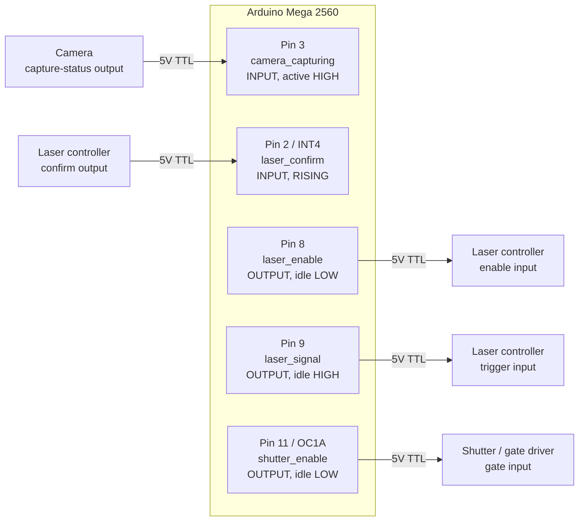
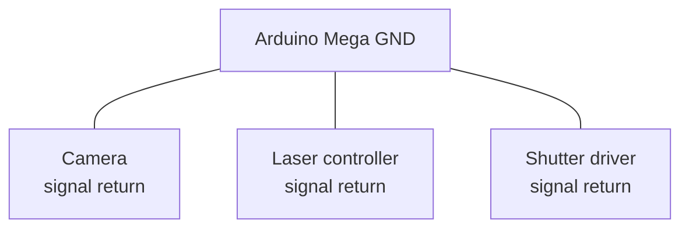
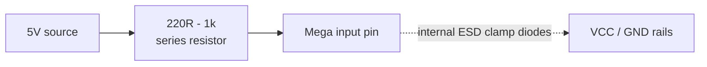
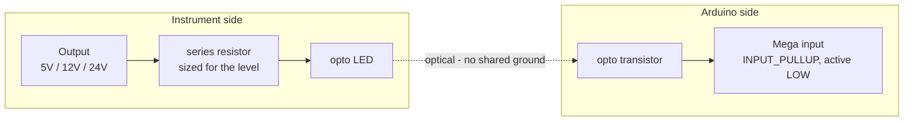
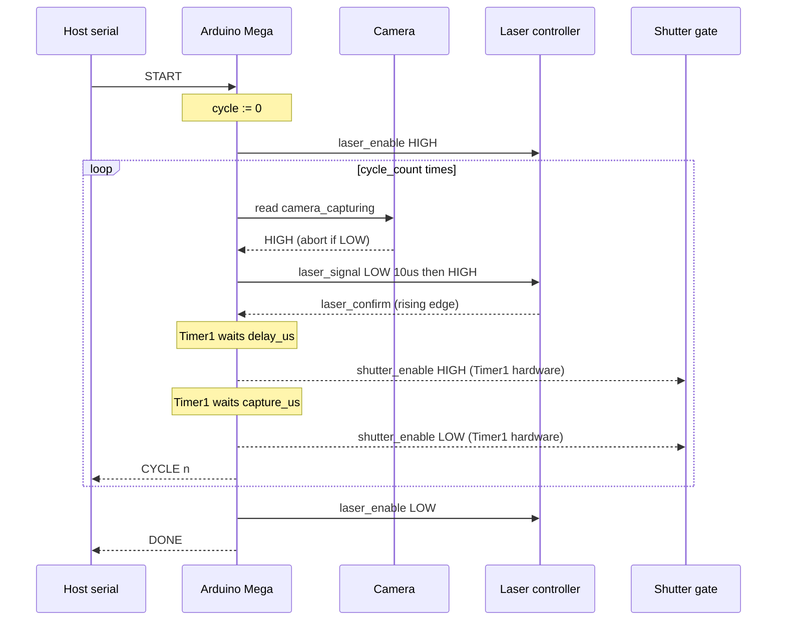
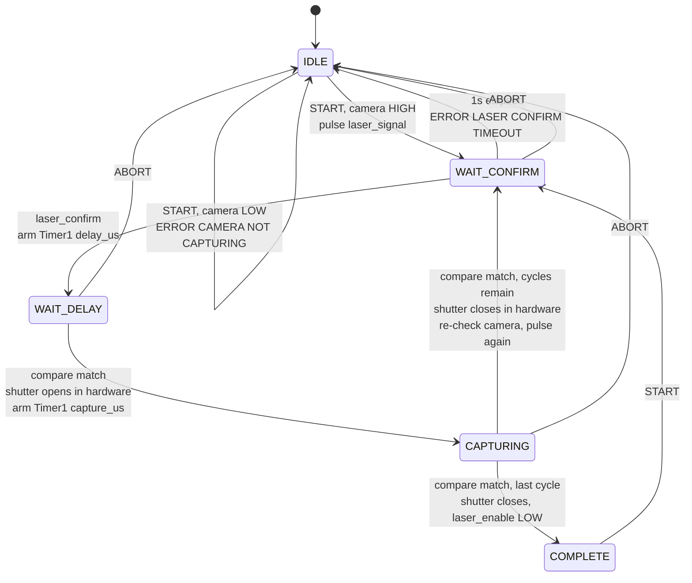

# 5 — Capture Sequence

The capture controller for the FRET rig. Arduino Mega 2560.

Runs `cycle_count` iterations of: verify the camera is rolling, hand off to the
laser, wait a configured delay, then open a capture gate for a configured
window. The delay and capture edges are produced by the Timer1 compare output
rather than by software, so interrupt latency stays out of the timing path.

Builds on [sketch 2](../2_pure_hardware_trigger) for the hardware-toggle
technique and [sketch 3](../3_serial_config) for the serial command interface.

> **Status:** compiles clean, **not yet hardware tested**. The `laser_signal`
> pulse width (10 µs) and the `laser_confirm` timeout (1 s) were unspecified
> and are placeholders — both are named constants at the top of the sketch.

## Signals

| Signal | Pin | Direction | Idle |
|--------|-----|-----------|------|
| `laser_confirm` | 2 (INT4) | in | — |
| `camera_capturing` | 3 | in | — |
| `laser_enable` | 8 | out | LOW |
| `laser_signal` | 9 | out | HIGH |
| `shutter_enable` | 11 (OC1A) | out | LOW |

`shutter_enable` must stay on pin 11 — it is the Timer1 Compare A output, and
that is what produces the gate edges in hardware.

`laser_confirm` must stay on an external interrupt pin. On the Mega 2560 those
are INT0=21, INT1=20, INT2=19, INT3=18, INT4=2, INT5=3.

Inputs are treated as **active-high and push-pull**. If a source is
open-collector, switch it to `INPUT_PULLUP`, flip `CAMERA_ACTIVE_LEVEL`, and
set `LASER_CONFIRM_EDGE` to `FALLING` — all three are constants at the top of
the sketch.

## Wiring



## Grounding

Every signal above is referenced to the Arduino's ground. Without a shared
return the levels are meaningless and inputs can be damaged — this is the most
common way a working 5V signal kills a pin.



## Input protection

5V logic is what the Mega expects: V<sub>IH</sub> is 0.6 × VCC = 3.0 V, and the
absolute maximum on a pin is VCC + 0.5 V = 5.5 V. Direct connection is fine for
genuine 5V push-pull sources on short cables.

A series resistor costs nothing and limits current through the internal ESD
clamps if a line ever overshoots past 5.5 V:



For instruments on separate supplies, long cable runs, or any output above 5 V,
use an optocoupler instead. This also removes ground loops between instrument
chassis and protects the board when the instrument is powered but the Arduino
is not — an easy state to hit in a lab:



Note the optoisolated form inverts the signal and needs a pull-up, so it is the
`INPUT_PULLUP` / `FALLING` configuration described under Signals.

## Sequence



## State machine



The shutter transitions are marked *in hardware* because Timer1 drives OC1A
directly — the ISR runs after the edge has already happened and only decides
what comes next.

## Commands

9600 baud, newline-terminated, case-insensitive.

| Command | Notes |
|---------|-------|
| `SET DELAY <us>` / `GET DELAY` | 1–1000000 µs |
| `SET CAPTURE <us>` / `GET CAPTURE` | 1–1000000 µs |
| `SET CYCLE_COUNT <n>` / `GET CYCLE_COUNT` | 1–65535 |
| `START` | Emits `STARTED`, `CYCLE <n>` per cycle, then `DONE` |
| `ABORT` (or `STOP`) | Drops laser_enable, releases the shutter |
| `STATUS` | State, cycle progress, live camera level |

`SET` is rejected with `ERROR BUSY` while a sequence is running. That
restriction is what makes it safe for the Timer1 ISR to read the configuration
without volatile qualifiers or interrupt guards.

Errors: `ERROR BUSY`, `ERROR CAMERA NOT CAPTURING`,
`ERROR LASER CONFIRM TIMEOUT`, `ERROR UNKNOWN COMMAND`,
`ERROR <FIELD> VALUE`, `ERROR <FIELD> RANGE <lo>-<hi>`.

`ABORT`/`STOP`, the confirm timeout, and `STATUS` were not in the original
spec. They were added because a laser controller needs a stop, a silent laser
should not be able to wedge the sequence with `laser_enable` held high, and
bring-up is easier with a status read. All three are easy to strip.

## Timing resolution

Timer1 auto-selects the smallest prescaler that can represent each duration, so
short windows keep full resolution and long ones are still reachable:

| Prescaler | Resolution | Max |
|-----------|-----------|-----|
| /1 | 0.0625 µs | 4095 µs |
| /8 | 0.5 µs | 32767 µs |
| /64 | 4 µs | 262140 µs |
| /256 | 16 µs | 1048560 µs |

`GET`/`SET` echo both the requested and the achieved value, e.g.
`OK DELAY 5000us -> 5000us (1250 ticks @ /64)`, so truncation is always visible
rather than silent.

## Build

```
arduino-cli compile --fqbn arduino:avr:mega . --warnings all
```
