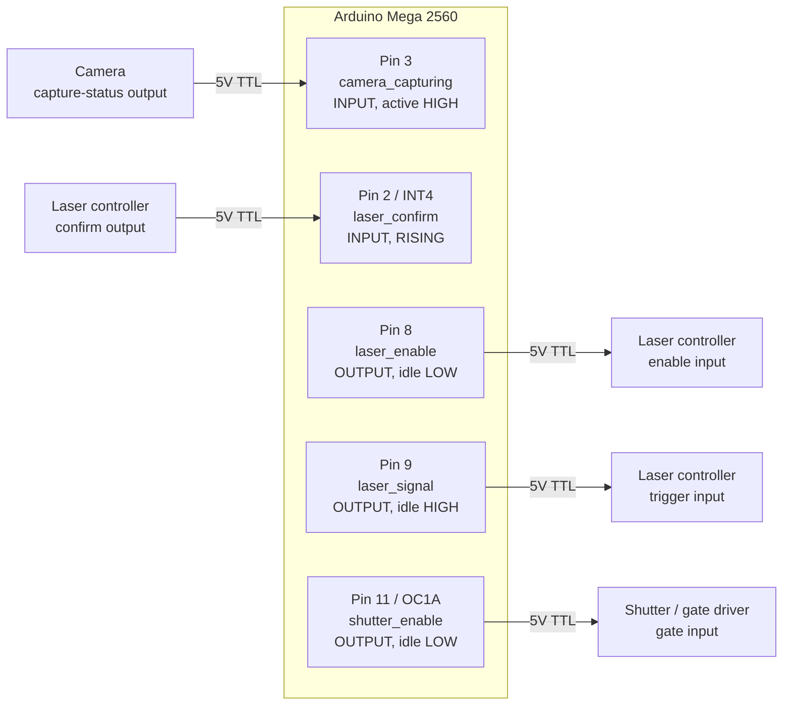
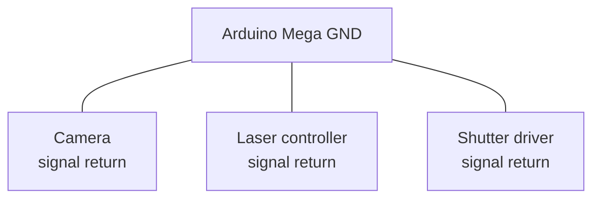
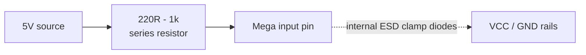
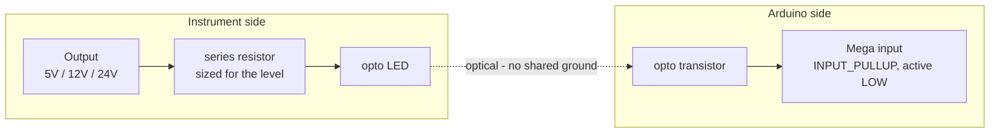
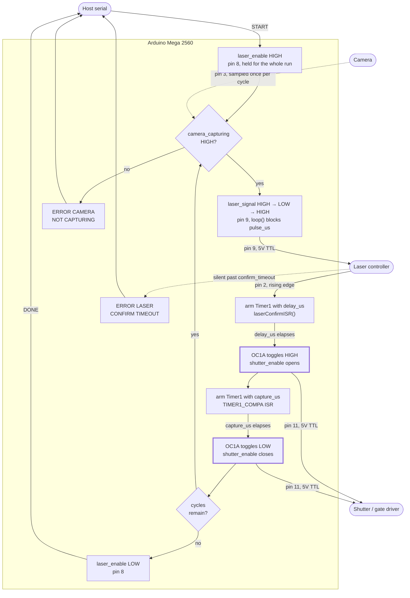
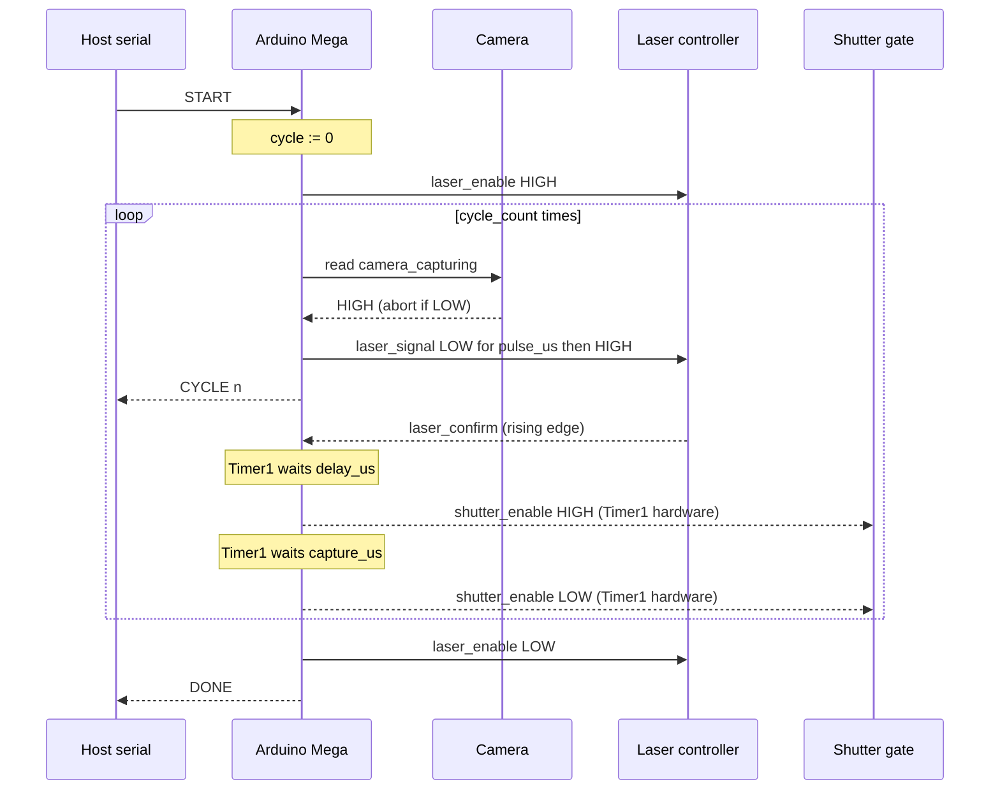
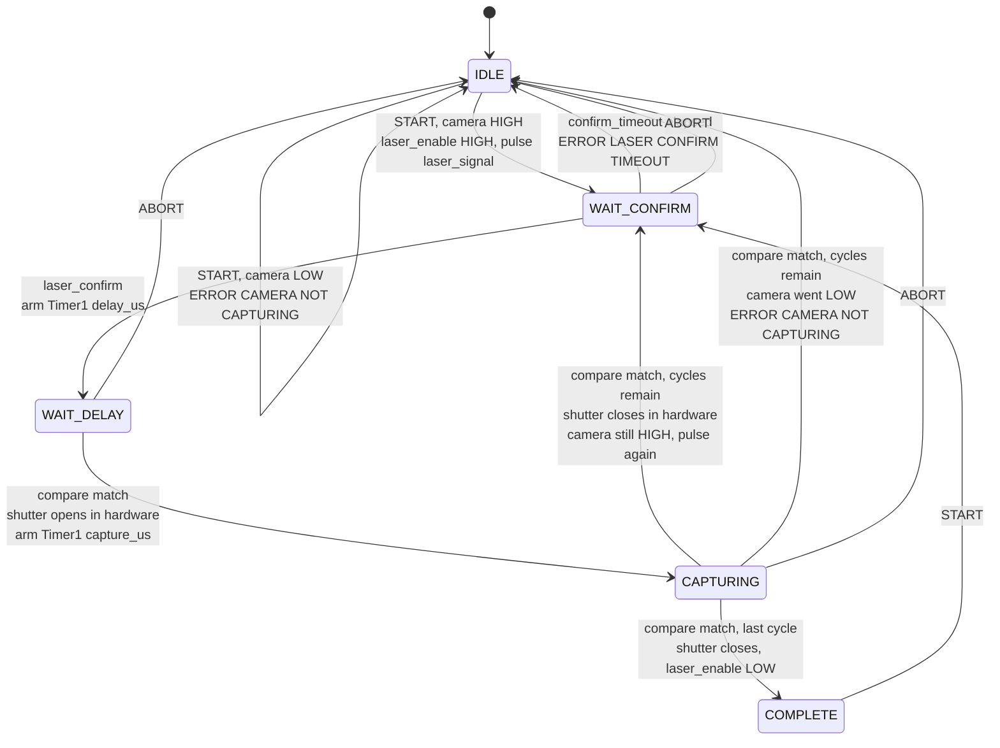

# 5 — Capture Sequence

The capture controller for the FRET rig. Arduino Mega 2560.

Runs `cycle_count` iterations of: verify the camera is rolling, hand off to the
laser, wait a configured delay, then open a capture gate for a configured
window. The delay and capture edges are produced by the Timer1 compare output
rather than by software, so interrupt latency stays out of the timing path.

Builds on [sketch 2](../2_pure_hardware_trigger) for the hardware-toggle
technique and [sketch 3](../3_serial_config) for the serial command interface.

> **Status:** compiles clean, **not yet hardware tested**. The `laser_signal`
> pulse width and the `laser_confirm` timeout were unspecified; both default to
> a guess (10 µs and 5000 ms) and are adjustable at runtime with `SET PULSE`
> and `SET CONFIRM_TIMEOUT`.

## Signals

| Signal | Pin | Direction | Idle |
|--------|-----|-----------|------|
| `laser_confirm` | 2 (INT4) | in | — |
| `camera_capturing` | 3 | in | — |
| `laser_enable` | 8 | out | LOW |
| `laser_signal` | 9 | out | HIGH |
| `shutter_enable` | 11 (OC1A) | out | LOW |

The [signal map](#signal-map) below shows how these five orchestrate a cycle.

`shutter_enable` must stay on pin 11 — it is the Timer1 Compare A output, and
that is what produces the gate edges in hardware.

`laser_confirm` must stay on an external interrupt pin. On the Mega 2560 those
are INT0=21, INT1=20, INT2=19, INT3=18, INT4=2, INT5=3.

Inputs are treated as **active-high and push-pull**. If a source is
open-collector, switch it to `INPUT_PULLUP`, flip `CAMERA_ACTIVE_LEVEL`, and
set `LASER_CONFIRM_EDGE` to `FALLING` — all three are constants at the top of
the sketch.

## Wiring



## Grounding

Every signal above is referenced to the Arduino's ground. Without a shared
return the levels are meaningless and inputs can be damaged — this is the most
common way a working 5V signal kills a pin.



## Input protection

5V logic is what the Mega expects: V<sub>IH</sub> is 0.6 × VCC = 3.0 V, and the
absolute maximum on a pin is VCC + 0.5 V = 5.5 V. Direct connection is fine for
genuine 5V push-pull sources on short cables.

A series resistor costs nothing and limits current through the internal ESD
clamps if a line ever overshoots past 5.5 V:



For instruments on separate supplies, long cable runs, or any output above 5 V,
use an optocoupler instead. This also removes ground loops between instrument
chassis and protects the board when the instrument is powered but the Arduino
is not — an easy state to hit in a lab:



Note the optoisolated form inverts the signal and needs a pull-up, so it is the
`INPUT_PULLUP` / `FALLING` configuration described under Signals.

## Signal map

A cycle is a closed loop that leaves the board on `laser_signal`, comes back
on `laser_confirm`, and only then lets Timer1 place the shutter gate. The two
inputs play different roles: `laser_confirm` is an **edge** that advances the
sequence, `camera_capturing` is a **level** that gates it. Of the outputs,
`laser_enable` is held for the whole run, `laser_signal` is a short pulse per
cycle, and `shutter_enable` is the one deliverable the whole thing exists to
place.

Solid arrows are edges that drive the sequence forward; dotted arrows are
levels sampled and timeouts — conditions rather than events. The two
thick-bordered nodes are transitions the hardware produces with no software in
the path.



Reading the loop as responsibilities rather than as a path:

| Signal | Who drives the edge | What it costs the timing |
|--------|--------------------|--------------------------|
| `laser_enable` | `loop()`, once per run | nothing — outside the timed window |
| `camera_capturing` | the camera; sampled in `beginCycle()` | nothing — read before the pulse |
| `laser_signal` | `loop()`, blocking `delayMicroseconds()` | `pulse_us`, before the timed window opens |
| `laser_confirm` | the laser; latched by an external interrupt | one ISR entry, before `delay_us` starts counting |
| `shutter_enable` | Timer1/OC1A, in hardware | none — no software between the compare match and the pin |

That last row is the point of the design, but it is worth being precise about
what it does and does not buy. Each *edge* is placed by the compare match
itself, so nothing `loop()` happens to be busy with — a serial write, a
blocking `delayMicroseconds()` — can push it late. What software still sits in
is the *arming* of each interval: `delay_us` is armed by `laserConfirmISR()`
and `capture_us` is re-armed by the compare ISR, and both reset `TCNT1`. Each
interval therefore runs about one interrupt entry longer than its configured
value — a few microseconds at 16 MHz. Small and near-constant, but not zero;
if the gate width has to be exact, measure it and trim `CAPTURE` to suit.

### One cycle in time

Not to scale: `delay_us` and `capture_us` are configurable up to a second each,
while `pulse_us` defaults to 10 µs.

```
                        START       confirm             open                    close done
                        v           v                   v                       v     v
  camera_capturing  ‾‾‾‾‾‾‾‾‾‾‾‾‾‾‾‾‾‾‾‾‾‾‾‾‾‾‾‾‾‾‾‾‾‾‾‾‾‾‾‾‾‾‾‾‾‾‾‾‾‾‾‾‾‾‾‾‾‾‾‾‾‾‾‾‾‾‾‾‾‾‾‾
  laser_enable      ____/‾‾‾‾‾‾‾‾‾‾‾‾‾‾‾‾‾‾‾‾‾‾‾‾‾‾‾‾‾‾‾‾‾‾‾‾‾‾‾‾‾‾‾‾‾‾‾‾‾‾‾‾‾‾‾‾‾‾‾‾‾\_____
  laser_signal      ‾‾‾‾‾‾‾‾\__/‾‾‾‾‾‾‾‾‾‾‾‾‾‾‾‾‾‾‾‾‾‾‾‾‾‾‾‾‾‾‾‾‾‾‾‾‾‾‾‾‾‾‾‾‾‾‾‾‾‾‾‾‾‾‾‾‾‾‾‾
  laser_confirm     ________________/‾\_____________________________________________________
  shutter_enable    ____________________________________/‾‾‾‾‾‾‾‾‾‾‾‾‾‾‾‾‾‾‾‾‾‾‾\___________
                                    |<---- delay_us --->|<------ capture_us --->|
```

`camera_capturing` is drawn flat because a cycle cannot start without it, but
it is only *read* once per cycle, just before the `laser_signal` pulse — a
camera that drops out mid-gate is not noticed until the next cycle begins. Only the rising edge of
`laser_confirm` matters; how long the laser holds it is ignored. And the gap
between `laser_signal` rising and `laser_confirm` arriving belongs to the
laser controller, not to this sketch — it is unbounded except by
`confirm_timeout`.

For a second cycle, everything from the camera sample to the shutter close
repeats with `laser_enable` still high; it drops only after the final gate
closes.

## Sequence



## State machine



The shutter transitions are marked *in hardware* because Timer1 drives OC1A
directly — the ISR runs after the edge has already happened and only decides
what comes next.

Two implementation details the diagram smooths over. The camera re-check and
the next `laser_signal` pulse happen in `loop()`, not in the ISR — the ISR sets
a flag, so the state stays `CAPTURING` for the moment between the shutter
closing and the next cycle arming. And a `confirm_timeout` of `0` removes the
`WAIT_CONFIRM --> IDLE` timeout edge entirely.

## Commands

9600 baud, newline-terminated, case-insensitive. The sketch prints `READY`
once on boot.

| Command | Range | Default | Meaning |
|---------|-------|---------|---------|
| `SET DELAY <us>` / `GET DELAY` | 1–1000000 µs | 1 | laser_confirm to shutter open |
| `SET CAPTURE <us>` / `GET CAPTURE` | 1–1000000 µs | 50 | shutter gate width |
| `SET CYCLE_COUNT <n>` / `GET CYCLE_COUNT` | 1–65535 | 1 | iterations per `START` |
| `SET PULSE <us>` / `GET PULSE` | 1–16383 µs | 10 | laser_signal low-pulse width |
| `SET CONFIRM_TIMEOUT <ms>` / `GET CONFIRM_TIMEOUT` | 0–600000 ms | 5000 | **0 disables** |
| `START` | — | — | Runs the sequence |
| `ABORT` (or `STOP`) | — | — | Drops laser_enable, releases the shutter |
| `STATUS` | — | — | State, cycle progress, live camera level |
| `HELP` (or `?`) | — | — | Lists every command |

`SET PULSE` is the runtime control for `LaserSignalPulseUs`;
`SET CONFIRM_TIMEOUT` for `ConfirmTimeoutMs`.

### HELP

`HELP` (or `?`) prints the table above from the firmware itself, with the
limits built from the same constants the parser enforces, so it cannot drift
out of step with the build actually on the board:

```
> HELP
OK HELP
  START                     run CYCLE_COUNT cycles
  ABORT | STOP              stop, drop laser_enable, free shutter
  STATUS                    state, cycle progress, camera level
  HELP | ?                  this list

  SET DELAY <us>            1-1000000us   laser_confirm to shutter open
  SET CAPTURE <us>          1-1000000us   shutter gate width
  SET CYCLE_COUNT <n>       1-65535       cycles per START
  SET PULSE <us>            1-16383us     laser_signal low-pulse width
  SET CONFIRM_TIMEOUT <ms>  0-600000ms    confirm wait, 0 disables

  GET reads back any of the five settings, e.g. GET DELAY.
  SET and HELP are rejected with ERROR BUSY while running.
OK HELP END
```

This is the one multi-line response in the protocol. Every body line is
indented by two spaces and the block is bracketed by `OK HELP` and
`OK HELP END`, so a host reading line by line can swallow everything between
the two markers without parsing the entries.

`HELP` is rejected with `ERROR BUSY` while a sequence is running, for a
different reason than `SET` is. The block is roughly 700 bytes — about 700 ms
at 9600 baud once the 64-byte transmit buffer backs up — and `loop()` is what
starts each next cycle, so printing it mid-run would stretch the gap between
cycles. The text is stored in flash with `F()`; in RAM it would cost a tenth of
the Mega's SRAM.

### Responses

```
READY
OK DELAY 5000us -> 5000us (10000 ticks @ /8)
OK CAPTURE 50us -> 50us (800 ticks @ /1)
OK CYCLE_COUNT 2
OK PULSE 25us
OK CONFIRM_TIMEOUT 5000ms
OK CONFIRM_TIMEOUT 0 (disabled)
OK ABORTED
OK STATUS IDLE CYCLE 0/2 CAMERA IDLE
```

`STATUS` is `OK STATUS <IDLE|RUNNING|COMPLETE> CYCLE <done>/<total> CAMERA
<IDLE|CAPTURING>`.

A full run emits, in order:

```
> START
STARTED
CYCLE 1
CYCLE 2
DONE
```

`CYCLE <n>` is printed when cycle *n* begins — just after its `laser_signal`
pulse — not when it finishes.

`PULSE` is capped at 16383 µs because that is the largest value
`delayMicroseconds()` handles accurately on AVR.

`CONFIRM_TIMEOUT 0` disables the timeout entirely, for a laser trusted to
always respond. Be aware that a silent laser will then wedge the sequence with
`laser_enable` held high until you send `ABORT`.

`SET` is rejected with `ERROR BUSY` while a sequence is running. For `DELAY`
and `CAPTURE` that restriction is load-bearing — it is what makes it safe for
the Timer1 ISR to read them without volatile qualifiers or interrupt guards.
`PULSE` and `CONFIRM_TIMEOUT` are only read from `loop()` and could safely
change mid-run, but are held to the same rule so the protocol has one
consistent behaviour.

### Errors

| Error | Cause |
|-------|-------|
| `ERROR UNKNOWN COMMAND` | Unrecognised input |
| `ERROR BUSY` | `START`, `HELP`, or any `SET` while a sequence is running |
| `ERROR CAMERA NOT CAPTURING` | `camera_capturing` low at the start of any cycle; sequence aborts |
| `ERROR LASER CONFIRM TIMEOUT` | No `laser_confirm` within `confirm_timeout`; sequence aborts |
| `ERROR <FIELD> VALUE` | Argument is not a plain non-negative integer |
| `ERROR <FIELD> RANGE <lo>-<hi>` | Argument parsed but out of range |

`<FIELD>` is `DELAY`, `CAPTURE`, `CYCLE_COUNT`, `PULSE`, or `CONFIRM_TIMEOUT`.
The `RANGE` message appends `us` for `DELAY` and `CAPTURE`
(`ERROR DELAY RANGE 1-1000000us`) and is unitless for the rest
(`ERROR PULSE RANGE 1-16383`).

### Beyond the original spec

The spec called for `delay_us`, `capture_us`, `cycle_count`, and `START`.
These were added and are all easy to strip:

- `ABORT`/`STOP` — a laser controller needs a stop.
- `CONFIRM_TIMEOUT` — a silent laser should not be able to wedge the sequence
  with `laser_enable` held high.
- `PULSE` — the spec said `laser_signal` toggles low then high but not for how
  long, so the width is a guess made adjustable rather than a buried constant.
- `STATUS` — bring-up is easier with a state read.
- `HELP`/`?` — the command set has grown past what is worth remembering at a
  serial monitor, and quoting the limits from the constants means the board
  documents itself.
- The prescaler selection, which extends `delay_us` and `capture_us` past the
  4096 µs a fixed unprescaled Timer1 would cap them at.

## Timing resolution

`DELAY` and `CAPTURE` are driven by Timer1, which is 16 bit and counts at
16 MHz. A single prescaler setting therefore cannot cover both a 1 µs delay and
a 1 s one. The sketch resolves each duration independently, picking the
**smallest prescaler that can represent it** — so short windows keep full
resolution and long ones stay reachable:

| Prescaler | Resolution | Used for | Max ticks |
|-----------|------------|----------|-----------|
| /1 | 0.0625 µs | 1 – 4096 µs | 65536 |
| /8 | 0.5 µs | 4097 – 32768 µs | 65536 |
| /64 | 4 µs | 32769 – 262144 µs | 65536 |
| /256 | 16 µs | 262145 – 1000000 µs | 62500 |

A request is rounded **down** to the resolution step of whichever prescaler is
chosen. `GET`/`SET` echo the requested value, the achieved value, the tick
count, and the prescaler, so any rounding is visible rather than silent:

```
SET DELAY 5000       ->  OK DELAY 5000us -> 5000us (10000 ticks @ /8)
SET CAPTURE 300001   ->  OK CAPTURE 300001us -> 300000us (18750 ticks @ /256)
```

`MIN_US` is 1 and `MAX_US` is 1000000. The code also contains a /1024 entry,
but it is unreachable: /256 already covers the full range up to `MAX_US`.

Timer1's CTC mode counts `0..OCR1A` inclusive, so the register is loaded with
one less than the tick count shown above.

## Build

```
arduino-cli compile --fqbn arduino:avr:mega . --warnings all
```
