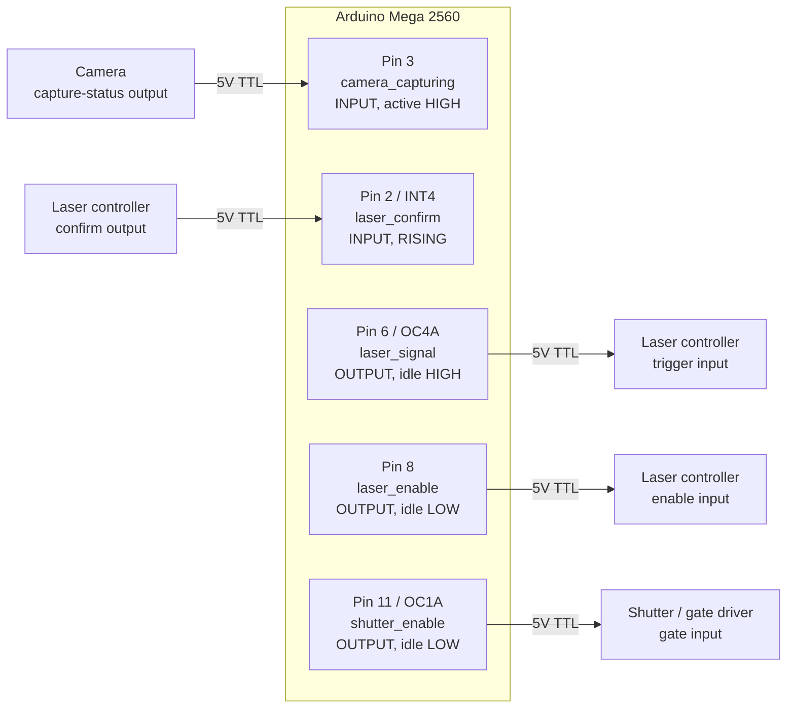
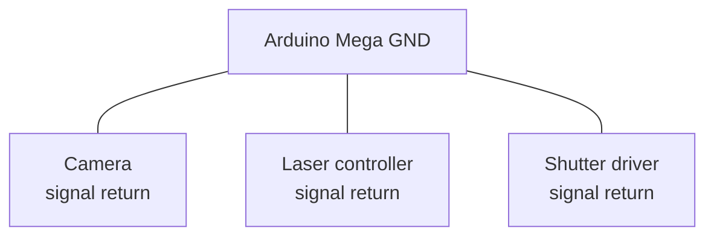
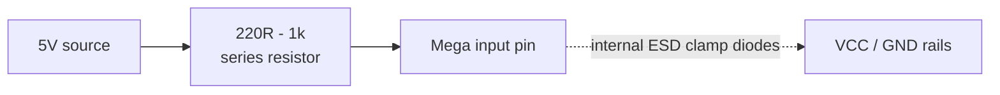
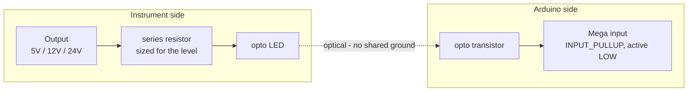
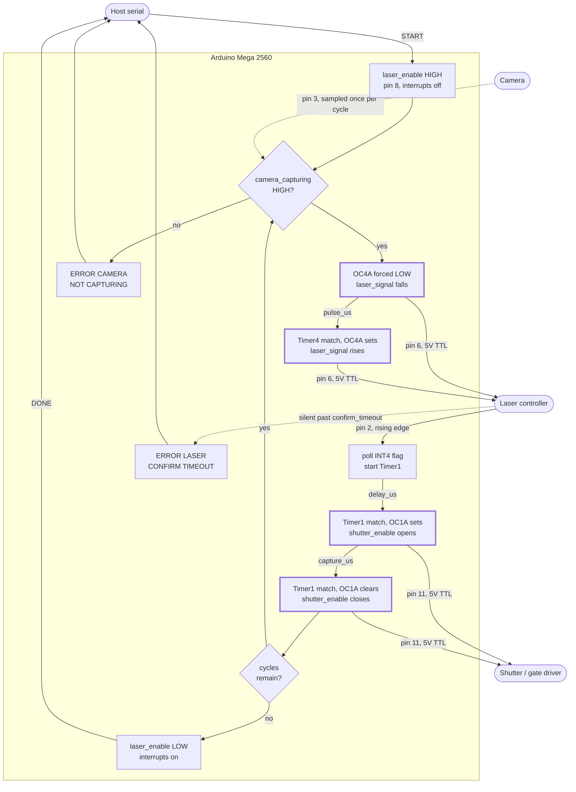
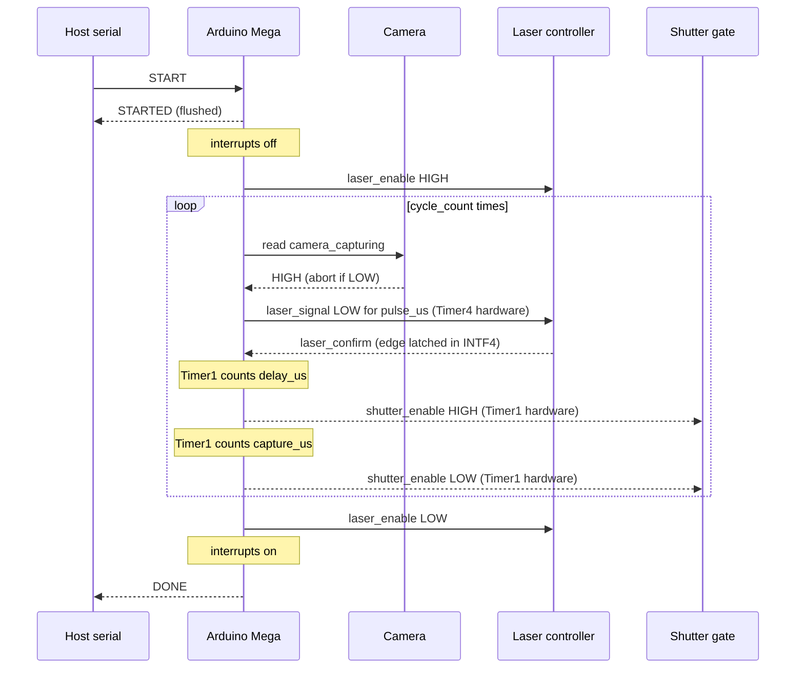
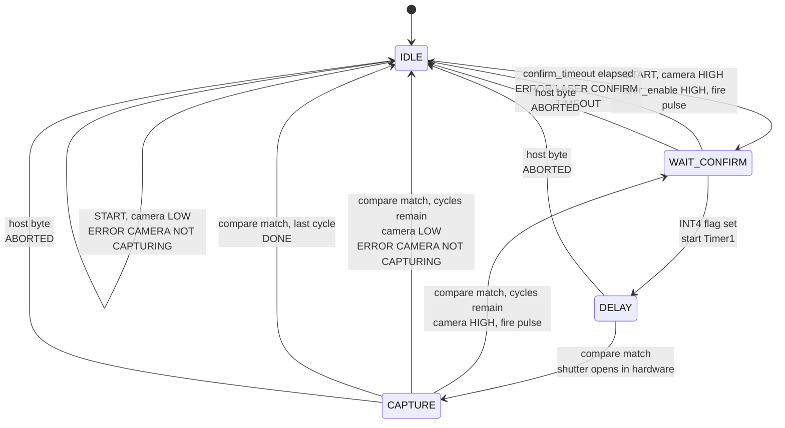

# 6 — Precise Capture Sequence

The capture controller for the FRET rig, reduced to timing and nothing else.
Arduino Mega 2560.

Runs `cycle_count` iterations of: verify the camera is rolling, pulse the
laser, wait for its confirm, wait a configured delay, then open the shutter for
a configured window. Every interval lands within **1 µs** of its setting.

Derived from [sketch 5](../5_capture_sequence). Same job and same serial
protocol shape. The verbose event log and the confirm debounce are gone, and
the timing path has been rebuilt so no software sits between an edge and the
timer that answers it.

> **Status:** compiles clean, **not yet bench tested**. The two latency
> constants in `Config.h` are counted from the compiled instructions, not
> measured. Check them on a scope before relying on sub-µs figures — see
> [Calibration](#calibration).

## What changed from sketch 5

| | Sketch 5 | Sketch 6 |
|---|---|---|
| `laser_signal` pulse | `delayMicroseconds()`, software edges | Timer4 on OC4A, both edges in hardware |
| `laser_confirm` | `attachInterrupt()` ISR, 3–5 µs entry | INT4 edge flag polled in a 5-cycle loop |
| `delay_us` / `capture_us` resolution | prescaler picked per value, 4–16 µs steps above 32 ms | always /1, exact to 62.5 ns up to 1 s |
| Interrupts during a run | Timer0, UART, confirm and compare ISRs | none |
| Serial during a run | `CYCLE n` per cycle, optional verbose log | nothing until the run ends |
| `laser_signal` pin | 9 | **6** (OC4A) |
| Settings | 7 | 5 — `CONFIRM_DEBOUNCE` and `VERBOSE` removed |
| `PULSE` range | 1–16383 µs | 1–4096 µs, one Timer4 period at /1 |

## Signals

| Signal | Pin | Direction | Idle |
|--------|-----|-----------|------|
| `laser_confirm` | 2 (INT4) | in | — |
| `camera_capturing` | 3 | in | — |
| `laser_signal` | **6 (OC4A)** | out | HIGH |
| `laser_enable` | 8 | out | LOW |
| `shutter_enable` | 11 (OC1A) | out | LOW |

Three pins are fixed by the hardware that times them, and each module has a
`static_assert` that fails the build if one is moved:

- `laser_signal` on **6** is the Timer4 Compare A output. It moved from pin 9
  so the timer can place both pulse edges and the CPU can watch for the confirm
  for the whole pulse.
- `shutter_enable` on **11** is the Timer1 Compare A output.
- `laser_confirm` on **2** is INT4. The sequence polls INT4's edge flag
  directly, so moving it means changing the flag it polls.

Inputs are treated as **active-high and push-pull**. For an open-collector or
optoisolated source, set `LASER_CONFIRM_INPUT_MODE` to `INPUT_PULLUP`,
`LASER_CONFIRM_EDGE` to `FALLING`, and flip `CAMERA_ACTIVE_LEVEL`, all in
`Config.h`.

## Wiring



## Grounding

Every signal above is referenced to the Arduino's ground. Without a shared
return the levels are meaningless and inputs can be damaged. This is the most
common way a working 5V signal kills a pin.



## Input protection

5V logic is what the Mega expects: V<sub>IH</sub> is 0.6 × VCC = 3.0 V, and the
absolute maximum on a pin is VCC + 0.5 V = 5.5 V. Direct connection is fine for
genuine 5V push-pull sources on short cables.

A series resistor costs nothing and limits current through the internal ESD
clamps if a line ever overshoots past 5.5 V:



For instruments on separate supplies, long cable runs, or any output above 5 V,
use an optocoupler instead. This also removes ground loops between instrument
chassis and protects the board when the instrument is powered but the Arduino
is not, which is an easy state to hit in a lab:



The optoisolated form inverts the signal and needs a pull-up, so it is the
`INPUT_PULLUP` / `FALLING` configuration described under Signals.

## Bench testing without a laser

There is no debounce, so **a push-button is not a usable stand-in** for
`laser_confirm`. One press delivers a train of edges; the first starts the
delay, and any that land after the next pulse are taken as that cycle's
confirm. Drive pin 2 from a function generator, or from a second board, with a
clean 5V edge. If a button is all there is, sketch 5's `CONFIRM_DEBOUNCE`
exists for exactly that.

## Signal map

A cycle is a closed loop that leaves the board on `laser_signal`, comes back
on `laser_confirm`, and only then lets Timer1 place the shutter gate.
`laser_confirm` is an **edge** that advances the sequence; `camera_capturing`
is a **level** that gates it.

Solid arrows are edges that drive the sequence forward; dotted arrows are
levels sampled and timeouts. The thick-bordered nodes are transitions a timer
produces with no software in the path.



| Signal | Who places the edge | What it costs the timing |
|--------|--------------------|--------------------------|
| `laser_enable` | `digitalWrite()`, once per run | nothing, outside every timed interval |
| `camera_capturing` | the camera; read before each pulse | nothing, read between cycles |
| `laser_signal` | Timer4 / OC4A, both edges | none, a fixed 2-cycle offset is preloaded away |
| `laser_confirm` | the laser; latched in INTF4 | 0–4 cycles of poll jitter on the front of `delay_us` |
| `shutter_enable` | Timer1 / OC1A, both edges | none |

### One cycle in time

Not to scale: `delay_us` and `capture_us` go up to a second each, while
`pulse_us` defaults to 10 µs.

```
                        START       confirm             open                    close done
                        v           v                   v                       v     v
  camera_capturing  ‾‾‾‾‾‾‾‾‾‾‾‾‾‾‾‾‾‾‾‾‾‾‾‾‾‾‾‾‾‾‾‾‾‾‾‾‾‾‾‾‾‾‾‾‾‾‾‾‾‾‾‾‾‾‾‾‾‾‾‾‾‾‾‾‾‾‾‾‾‾‾‾
  laser_enable      ____/‾‾‾‾‾‾‾‾‾‾‾‾‾‾‾‾‾‾‾‾‾‾‾‾‾‾‾‾‾‾‾‾‾‾‾‾‾‾‾‾‾‾‾‾‾‾‾‾‾‾‾‾‾‾‾‾‾‾‾‾‾\_____
  laser_signal      ‾‾‾‾‾‾‾‾\__/‾‾‾‾‾‾‾‾‾‾‾‾‾‾‾‾‾‾‾‾‾‾‾‾‾‾‾‾‾‾‾‾‾‾‾‾‾‾‾‾‾‾‾‾‾‾‾‾‾‾‾‾‾‾‾‾‾‾‾‾
  laser_confirm     ________________/‾\_____________________________________________________
  shutter_enable    ____________________________________/‾‾‾‾‾‾‾‾‾‾‾‾‾‾‾‾‾‾‾‾‾‾‾\___________
                            |<>|    |<---- delay_us --->|<------ capture_us --->|
                          pulse_us
```

The confirm can arrive at any point after the pulse **starts**, during the
pulse included. The flag is cleared just before the falling edge and polled
from then on. Only the configured edge of `laser_confirm` matters; how long
the laser holds it is ignored. The gap between the pulse and the confirm
belongs to the laser controller, bounded only by `confirm_timeout`.

`camera_capturing` is read once per cycle, before the pulse. A camera that
drops out mid-gate is not noticed until the next cycle begins.

## Sequence



## State machine

The run is one blocking call, so these states are places in `runCycle()`
rather than a variable. From the host's side there are only two: idle and
answering commands, or running and deaf to everything except "stop".



A `confirm_timeout` of `0` removes the timeout edge. A host byte is noticed
once a millisecond while waiting for the confirm, and at every segment
boundary (at most 1.024 ms apart) during the windows. Every exit to `IDLE`
closes the shutter and returns `laser_signal` and `laser_enable` to idle.

## Timing

### The budget

| Interval | Starts on | Ends on | Error |
|----------|-----------|---------|-------|
| `pulse_us` | OC4A forced LOW | Timer4 compare match | 0, fixed offset preloaded |
| `delay_us` | `laser_confirm` edge | Timer1 compare match | ±0.2 µs; +0.85 µs worst case |
| `capture_us` | Timer1 compare match | Timer1 compare match | 0 |

All three are relative to the board's own 16 MHz clock. See
[Clock accuracy](#clock-accuracy) for what that means over long windows.

**`capture_us` is exact** because both of its edges are compare matches on one
counter. Long windows run as a chain of Timer1 periods, but CTC restarts the
counter in hardware at each match, so software reloading the next period only
has to arrive in time. It never moves an edge.

**`pulse_us` is exact** for the same reason, with one fixed offset. The falling
edge is a forced compare, the rising edge a match, and the two register
writes that fire the pulse are 2 cycles apart. Timer4 is preloaded with those
2 ticks.

**`delay_us` carries the one piece of software left in the timing path.**
Nothing can start a timer from an external edge on the ATmega2560. So the
edge is latched in hardware (INT4's flag, set even with the interrupt masked)
and a polling loop starts Timer1 when it sees it:

```
wait:  sbic EIFR, INTF4      ; 2 cycles while clear
       rjmp go
       sbis TIFR3, OCF3A     ; millisecond tick?
       rjmp wait             ; loop is 5 cycles
       ...
go:    sts  TCCR1B, r9       ; Timer1 running
```

The flag is sampled every 5 cycles, so the start moves by 0–4 cycles
(0–0.25 µs) depending on where the edge falls. `CONFIRM_TO_TIMER1_TICKS`
preloads Timer1 with the average latency, which leaves about ±0.2 µs.

Once a millisecond the loop takes an 11-cycle branch to clear the tick, check
the UART and count down the timeout. An edge that lands inside that branch
waits for it and is seen up to 15 cycles late instead of 4. That is the
+0.85 µs worst case, and it happens to about 1 edge in 1000. To keep the
branch that short, a disabled timeout still counts down; it just never acts.

### Why interrupts are off

Every source of jitter sketch 5 lived with was an interrupt:

- `millis()` runs a Timer0 ISR every 1.024 ms for about 5 µs. An edge that
  arrives during it waits.
- Entering the `attachInterrupt()` confirm ISR costs 3–5 µs of register saves
  before the first line of the handler.
- Serial transmit runs a UART ISR per byte.

With interrupts off from `START` to the last edge, none of these can happen,
and the cycle count of every path is fixed. The cost is that the run cannot
be interrupted by anything. The run polls the UART itself: **any byte from the
host aborts the run**. That byte is left in the UART, so the command it
belongs to is read and answered normally once the run returns.

`millis()` stops advancing during a run. Nothing in this sketch depends on it.

### The 1 µs deadline

After each compare match, the next segment's `OCR1A` must be loaded before
the counter reaches the old top again. Otherwise CTC restarts it a second
time and the next window starts late. For a 1 µs delay that is 16 cycles
after the match. The path from the match flag to the reload is:

```
       sbis TIFR1, OCF1A     ; 3-cycle poll
       rjmp .-4
       out  TIFR1, r11       ; clear the flag
       sts  OCR1AH, r19      ; next top, precomputed
       sts  OCR1AL, r18
       sts  TCCR1A, r30      ; what the next match does
```

For the tightest case, `DELAY 1` then `CAPTURE 1`, the reload lands at least
4 cycles early. The first reload is peeled out of the loop, and the next
segment is computed before the confirm arrives, so no loop setup or
arithmetic can drift into that path. Segments are split into near-equal
lengths of 8192–16384 ticks, so every later reload has at least half a
millisecond.

**If you edit `runCycle()` or the inline functions in `Shutter.h` or
`LaserPulse.h`, re-check the disassembly.** The compiler is free to move code
between the confirm and the Timer1 start, and it did so in early drafts of
this file. `avr-objdump` ships with the core, under
`Arduino15/packages/arduino/tools/avr-gcc/*/bin`:

```
arduino-cli compile --fqbn arduino:avr:mega . --build-path build
avr-objdump -d build/6_precise_capture.ino.elf | grep -A40 "sbic.*0x1c, 4"
```

### Calibration

The two constants in `Config.h` are counted from the instructions above.
Synchronising the input pin adds another 0.5–1.5 cycles, which is only
estimated. Measure both constants once on a scope and adjust:

| Constant | Measure | Adjust by |
|----------|---------|-----------|
| `CONFIRM_TO_TIMER1_TICKS` (8) | `laser_confirm` edge → `shutter_enable` rise at `DELAY 10` | (measured − 10 µs) × 16 |
| `PULSE_FALL_TO_TIMER4_TICKS` (2) | `laser_signal` low width at `PULSE 10` | (measured − 10 µs) × 16 |

A measured value that is too long means the constant is too small. Each tick
is 62.5 ns.

### Clock accuracy

"Within 1 µs" is measured against the board's own clock. Every interval is a
tick count, so a clock that runs 50 ppm fast makes every interval 50 ppm
short. That is nothing at 50 µs, but 50 µs at one second. Mega boards and
clones ship with either a crystal (typically 10–100 ppm) or a ceramic
resonator (up to 0.5%). The 1 µs figure holds at any length only if the
clock is good to 1 ppm. With a typical crystal, clock error passes 1 µs
somewhere around 10–100 ms. Measure a 1 s `CAPTURE` on a counter to find out
where this board stands.

## Commands

9600 baud, newline-terminated, case-insensitive. On boot the sketch prints the
banner and then `READY`.

| Command | Range | Default | Meaning |
|---------|-------|---------|---------|
| `SET DELAY <us>` / `GET DELAY` | 1–1000000 | 1 | laser_confirm to shutter open |
| `SET CAPTURE <us>` / `GET CAPTURE` | 1–1000000 | 50 | shutter gate width |
| `SET CYCLE_COUNT <n>` / `GET CYCLE_COUNT` | 1–65535 | 1 | cycles per `START` |
| `SET PULSE <us>` / `GET PULSE` | 1–4096 | 10 | laser_signal low-pulse width |
| `SET CONFIRM_TIMEOUT <ms>` / `GET CONFIRM_TIMEOUT` | 0–600000 | 5000 | **0 disables** |
| `START` | — | — | Runs the sequence |
| `ABORT` (or `STOP`) | — | — | Releases every output |
| `STATUS` | — | — | Last run's progress, live camera level |
| `INFO` | — | — | Reprints the boot banner |
| `HELP` (or `?`) | — | — | Lists every command |

Every setting is an exact whole number of microseconds or milliseconds; there
is no rounding to report, so `SET` echoes the value back as `GET` would.

The five settings are one table in `Commands.cpp`. `GET`, `SET`, `HELP` and
the banner all read from it, so a name, range or unit is written once.

### HELP

```
> HELP
OK HELP
  START                     run CYCLE_COUNT cycles
  ABORT | STOP              release all outputs
  STATUS                    last run's progress, camera level
  INFO                      reprint the boot banner
  HELP | ?                  this list

  SET DELAY <us>            1-1000000     laser_confirm to shutter open
  SET CAPTURE <us>          1-1000000     shutter gate width
  SET CYCLE_COUNT <n>       1-65535       cycles per START
  SET PULSE <us>            1-4096        laser_signal low-pulse width
  SET CONFIRM_TIMEOUT <ms>  0-600000      confirm wait, 0 disables

  GET reads back any setting, e.g. GET DELAY.
  Any input during a run aborts it.
OK HELP END
```

Body lines are indented and the block is bracketed by `OK HELP` and
`OK HELP END`, so a host can swallow everything between the markers.

### Boot banner

`setup()` prints this before `READY`, and `INFO` reprints it on demand:

```
INFO
              ___
             |[_]|
             |   |
             | | |
            _|___|_
           |       |
            \_____/
             \___/
        _______________
       |  [=========]  |
       |_______________|
              | |
         _____|_|_____
        /             \
       /_______________\

  FRET Precise Capture Sequence
  version 1.0.0   built Sep 24 2026 10:00:00
  Arduino Mega 2560   serial 9600 8N1

  Pins
    laser_enable      8    output, held HIGH for the run
    laser_signal      6    output, OC4A, idles HIGH, pulses LOW
    laser_confirm     2    input, INT4 flag on RISING
    camera_capturing  3    input, active HIGH
    shutter_enable    11   output, OC1A, driven by Timer1

  Settings
    DELAY             1us
    CAPTURE           50us
    CYCLE_COUNT       1
    PULSE             10us
    CONFIRM_TIMEOUT   5000ms

  Inputs now
    camera_capturing  IDLE
    laser_confirm     LOW

  HELP lists the commands, STATUS reports the last run.
INFO END
READY
```

Pins and settings are printed from the constants and the live values, so the
banner cannot describe a build or a configuration the board is not running.
`built` is the compile time of `6_precise_capture.ino`; build with `--clean`
when it has to be right. `READY`, not the banner, is the boot marker.

### Responses

```
READY
OK DELAY 5000us
OK CAPTURE 50us
OK CYCLE_COUNT 2
OK PULSE 25us
OK CONFIRM_TIMEOUT 5000ms
OK CONFIRM_TIMEOUT 0 (disabled)
OK ABORTED
OK STATUS CYCLE 2/2 CAMERA CAPTURING
```

`STATUS` is `OK STATUS CYCLE <finished>/<total> CAMERA <IDLE|CAPTURING>`,
where `<finished>` counts the cycles the last run completed.

A run prints `STARTED`, then nothing, then exactly one line saying how it
ended:

```
> START
STARTED
DONE
```

| Last line | Meaning |
|-----------|---------|
| `DONE` | every cycle ran |
| `ABORTED` | the host sent something |
| `ERROR CAMERA NOT CAPTURING` | `camera_capturing` was low before a cycle |
| `ERROR LASER CONFIRM TIMEOUT` | no confirm within `confirm_timeout` |

Aborting mid-run gives the run's line, then the reply to the command that
stopped it:

```
> START
STARTED
> ABORT
ABORTED
OK ABORTED
```

Any line stops a run, not only `ABORT`. A `STATUS` sent mid-run ends the run
and then reports how far it got.

### Errors

| Error | Cause |
|-------|-------|
| `ERROR UNKNOWN COMMAND` | Unrecognised input |
| `ERROR CAMERA NOT CAPTURING` | `camera_capturing` low at `START` or before any cycle |
| `ERROR LASER CONFIRM TIMEOUT` | No `laser_confirm` within `confirm_timeout` |
| `ERROR <FIELD> VALUE` | Argument is not a plain non-negative integer |
| `ERROR <FIELD> RANGE <lo>-<hi>` | Argument parsed but out of range |

`ERROR BUSY` is gone: a command can only be read between runs.

## Source layout

| Module | Holds | Depends on |
|--------|-------|------------|
| `Config.h/.cpp` | Pins, polarity, limits, latency compensation, identity | — |
| `Settings.h/.cpp` | The five values `SET`/`GET` operate on | — |
| `Shutter.h/.cpp` | Timer1: window planning, segments, OC1A | Config |
| `LaserPulse.h/.cpp` | Timer4: the pulse on OC4A | Config |
| `Sequence.h/.cpp` | The run: camera check, confirm wait, segment feed | all of the above |
| `Commands.h/.cpp` | The serial protocol, `HELP`, the banner | Config, Settings, Sequence |

`6_precise_capture.ino` holds the overview, the build stamp, `setup()` and
`loop()`.

Each timer has one job and one module: Timer1 the shutter, Timer4 the pulse,
Timer3 the millisecond tick for the confirm timeout (in `Sequence.cpp`, no
pins connected). Timer0 still drives `millis()` between runs. Timer5 is free.

The functions on the timed path are `static inline` in the headers rather
than behind a call. That keeps their cycle counts fixed wherever they are
used.

## Build

```
arduino-cli compile --fqbn arduino:avr:mega . --warnings all
```

Builds clean with `--warnings all`. Add `--clean` when the banner's `built`
timestamp needs to be accurate.
