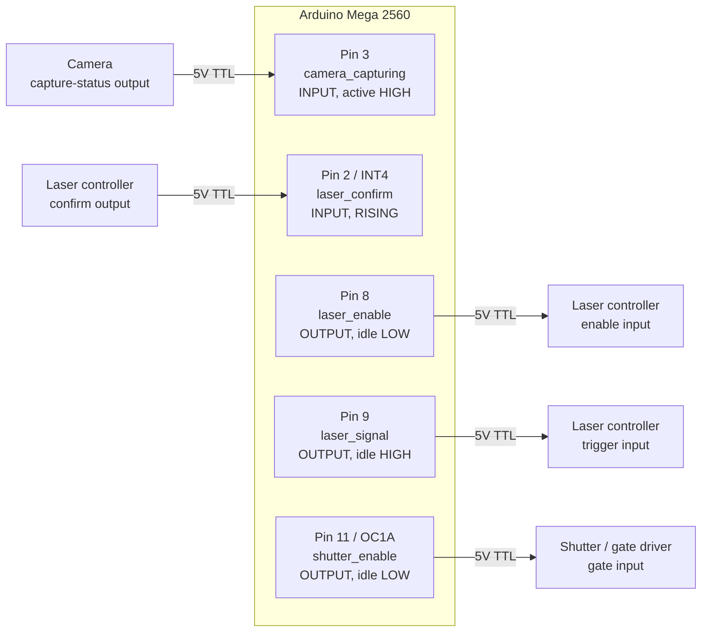
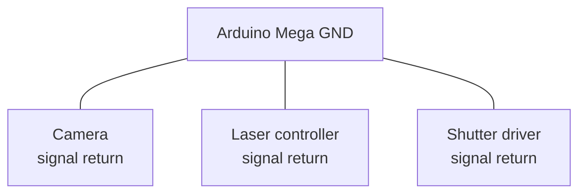
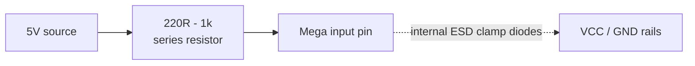
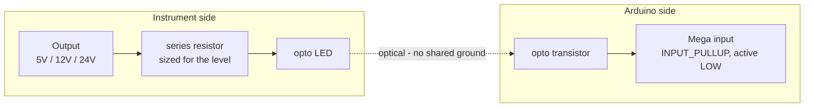
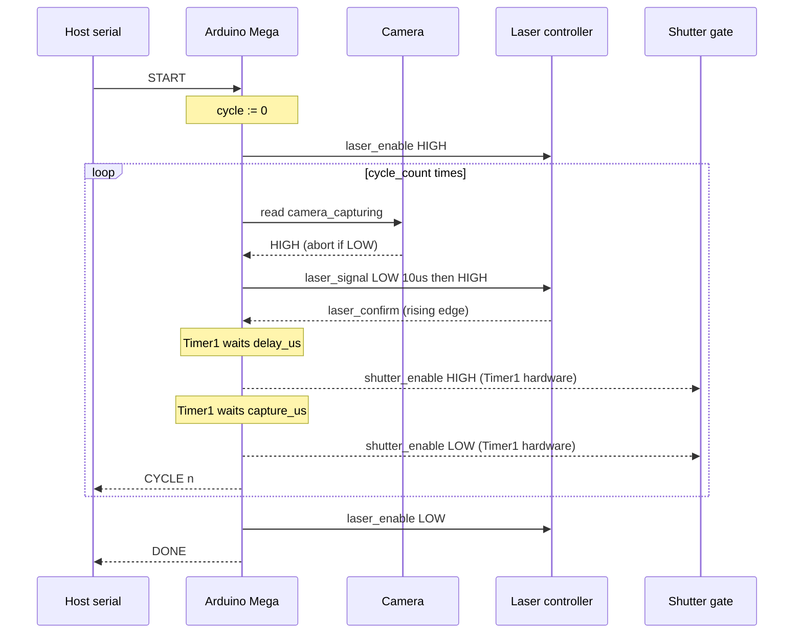
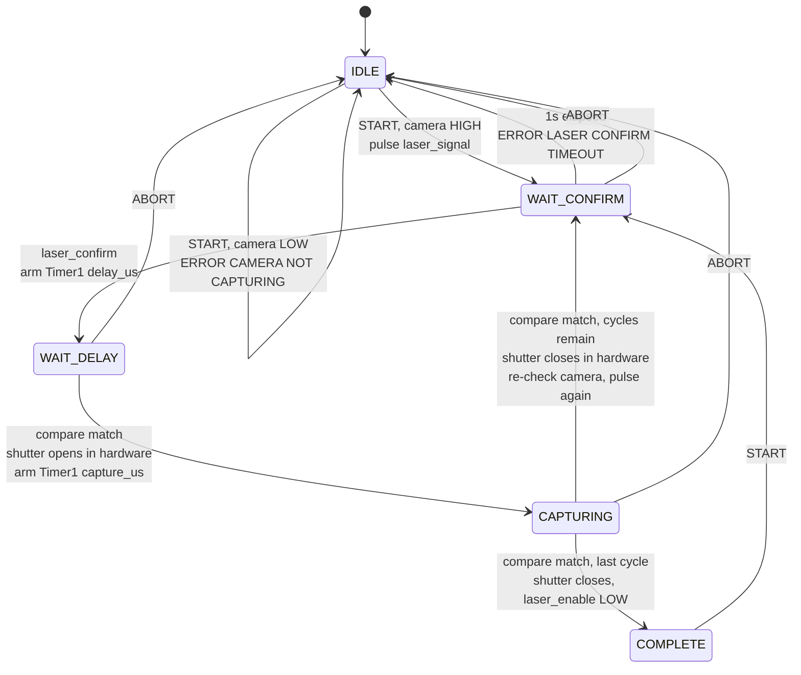

# FRET Microscope Timing

Firmware experiments for hardware-timed laser/shutter sequencing on a FRET
microscope. Target board is an **Arduino Mega 2560** (16 MHz, ATmega2560).

The sketches are a numbered ladder — each one adds a capability on the way to
the real controller. They are meant to be read in order, not as independent
utilities.

## Sketches

| # | Sketch | What it demonstrates |
|---|--------|----------------------|
| 0 | `0_input_signal_output_pin` | Read an input pin, drive an output pin, report edges over serial. |
| 1 | `1_hardware_trigger_delay_timer` | External interrupt starts Timer1; the compare ISR toggles the output ~1 s later. |
| 2 | `2_pure_hardware_trigger` | Same delay, but Timer1 hardware toggles OC1A directly — no `digitalWrite()` in the signal path. |
| 3 | `3_serial_config` | Serial command interface for delay / exposure / cycle count, plus the capture-sequence state machine. |
| 4 | `4_shift_register_dis` | 4-digit 7-segment display driven over hardware SPI, multiplexed from a Timer2 ISR. |
| 5 | `5_capture_sequence` | The real controller: camera gate check, laser handshake, hardware-timed delay and capture window, repeated for a configured cycle count. |

## Wiring

Common to the trigger sketches (0–3):

```
Trigger input   Pin 2  (INT4) -- button or laser-return signal -- GND
                        uses INPUT_PULLUP: idle = HIGH, asserted = LOW

Output / LED    Pin 11 (OC1A) -- 330 ohm -- LED -- GND
```

Pin 11 is chosen specifically because it is **OC1A**, the Timer1 Compare A
output. That lets Timer1 drive the pin in hardware, which is what removes
interrupt-latency jitter from the timing path.

Display sketch (4):

```
Latch (RCLK)    Pin 6
SPI MOSI        Pin 51
SPI SCK         Pin 52
SPI SS          Pin 53   (must be OUTPUT for hardware SPI master mode)
```

Shift registers are clocked `LSBFIRST`, SPI mode 0. Two bytes per refresh:
digit select, then segment data. Segment bytes are active-low.

## Serial protocol (sketch 3)

9600 baud, newline-terminated commands.

| Command | Response |
|---------|----------|
| `ENABLE` | `OK ENABLED` |
| `DISABLE` | `OK DISABLED` |
| `START` | `STARTED`, then `LASER <n>` per cycle, then `DONE` |
| `GET DELAY` / `SET DELAY <us>` | `OK DELAY <us>us (<ticks> ticks)` |
| `GET EXPOSURE` / `SET EXPOSURE <us>` | `OK EXPOSURE <us>us (<ticks> ticks)` |
| `GET CYCLE_COUNT` / `SET CYCLE_COUNT <n>` | `OK CYCLE COUNT <n>` |

Delay and exposure accept **1–4095 µs**. Timer1 is 16 bit and runs unprescaled
at 16 MHz, so 65535 ticks / 16 = 4095 µs is the longest period it can express.
Out-of-range values are rejected, not truncated. Widening this range means
introducing a prescaler, which costs timing resolution.

Errors: `ERROR NOT ENABLED`, `ERROR BUSY`, `ERROR UNKNOWN COMMAND`,
`ERROR <FIELD> VALUE` (unparseable), `ERROR <FIELD> RANGE <lo>-<hi>`.

`DISABLE` aborts any running sequence and returns the shutter to closed.

## Timer reference

Timer1 at 16 MHz with prescaler 256 gives 62,500 counts/sec. CTC counts
`0..OCR1A` inclusive, so a 1 second period is `OCR1A = 62499`.

Without a prescaler, Timer1 ticks at 16 MHz — 16 ticks per microsecond. That is
the basis for the `us -> ticks` conversion in sketch 3.

## Capture sequence (sketch 5)

### Signals

| Signal | Pin | Direction | Idle |
|--------|-----|-----------|------|
| `laser_confirm` | 2 (INT4) | in | — |
| `camera_capturing` | 3 | in | — |
| `laser_enable` | 8 | out | LOW |
| `laser_signal` | 9 | out | HIGH |
| `shutter_enable` | 11 (OC1A) | out | LOW |

`shutter_enable` must stay on pin 11 — it is the Timer1 Compare A output, and
that is what produces the gate edges in hardware.

Inputs are treated as **active-high and push-pull**. If a source is
open-collector, switch it to `INPUT_PULLUP`, flip `CAMERA_ACTIVE_LEVEL`, and
set `LASER_CONFIRM_EDGE` to `FALLING` — all three are constants at the top of
the sketch.

### Wiring



### Grounding

Every signal above is referenced to the Arduino's ground. Without a shared
return the levels are meaningless and inputs can be damaged — this is the most
common way a working 5V signal kills a pin.



### Input protection

Direct connection is fine for genuine 5V push-pull sources on short cables.
A series resistor costs nothing and limits current through the internal ESD
clamps if a line ever overshoots past VCC + 0.5V:



For instruments on separate supplies, long cable runs, or any output above 5V,
use an optocoupler instead. This also removes ground loops between instrument
chassis and protects the board when the instrument is powered but the Arduino
is not:



Note the optoisolated form inverts the signal and needs a pull-up, so it is
the `INPUT_PULLUP` / `FALLING` configuration mentioned above.

### Sequence



### State machine



The shutter transitions are marked *in hardware* because Timer1 drives OC1A
directly — the ISR runs after the edge has already happened and only decides
what comes next.

### Commands

9600 baud, newline-terminated, case-insensitive.

| Command | Notes |
|---------|-------|
| `SET DELAY <us>` / `GET DELAY` | 1–1000000 µs |
| `SET CAPTURE <us>` / `GET CAPTURE` | 1–1000000 µs |
| `SET CYCLE_COUNT <n>` / `GET CYCLE_COUNT` | 1–65535 |
| `START` | Emits `STARTED`, `CYCLE <n>` per cycle, then `DONE` |
| `ABORT` (or `STOP`) | Drops laser_enable, releases the shutter |
| `STATUS` | State, cycle progress, live camera level |

`SET` is rejected with `ERROR BUSY` while a sequence is running. That
restriction is what makes it safe for the Timer1 ISR to read the configuration
without volatile qualifiers or interrupt guards.

Errors: `ERROR BUSY`, `ERROR CAMERA NOT CAPTURING`,
`ERROR LASER CONFIRM TIMEOUT`, `ERROR UNKNOWN COMMAND`,
`ERROR <FIELD> VALUE`, `ERROR <FIELD> RANGE <lo>-<hi>`.

### Timing resolution

Sketch 5 picks the smallest Timer1 prescaler that can represent each duration,
so short windows keep full resolution and long ones are still reachable:

| Prescaler | Resolution | Max |
|-----------|-----------|-----|
| /1 | 0.0625 µs | 4095 µs |
| /8 | 0.5 µs | 32767 µs |
| /64 | 4 µs | 262140 µs |
| /256 | 16 µs | 1048560 µs |

`GET`/`SET` echo both the requested and the achieved value, e.g.
`OK DELAY 5000us -> 5000us (1250 ticks @ /64)`, so truncation is always
visible rather than silent.

## Design notes

**No `Serial` inside an ISR.** A single line at 9600 baud blocks for roughly a
millisecond — orders of magnitude longer than the exposures being timed. The
ISRs raise flags and `loop()` does the printing.

**Shutter transitions are hardware.** OC1A is left in Timer1 toggle mode, so
the delay and exposure edges are produced by the timer peripheral itself. No
`digitalWrite()` sits in the timing path, which is what keeps interrupt latency
out of the measurement.

Because toggle mode is parity-dependent, `resetShutter()` momentarily
disconnects the compare output to force a known-closed state at the start of a
sequence and on abort.

## Status

Sketch 5 is the current target and compiles clean, but has not been run
against hardware. The `laser_signal` pulse width (10 µs) and the
`laser_confirm` timeout (1 s) were not specified and are placeholders.

Sketch 3 runs the full state machine — laser return, delay, exposure, cycle
count — with Timer1 driving the shutter edges. Turning the physical laser on
and off is still stubbed with `TODO` markers pending that pin assignment.
